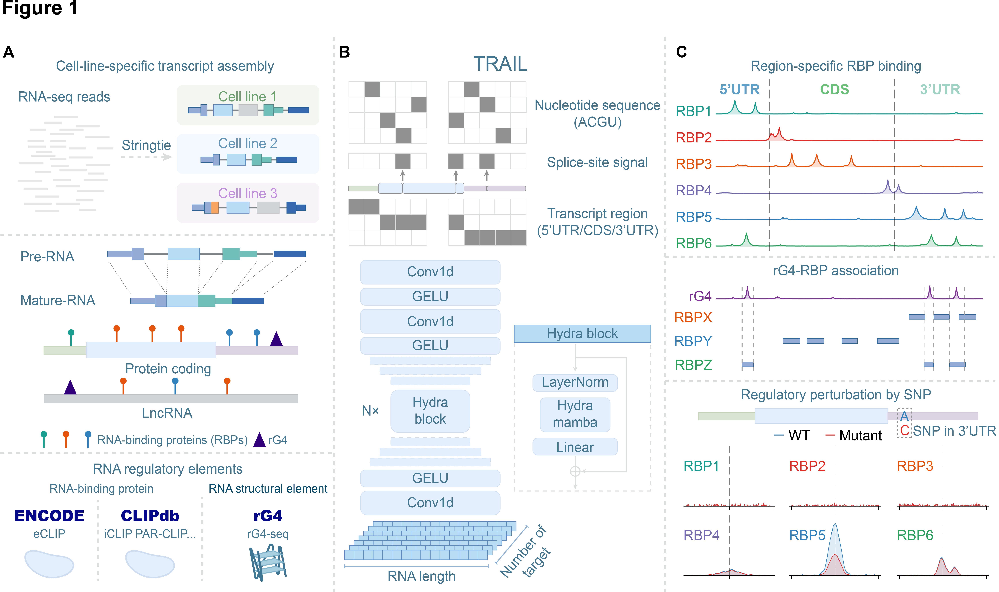

# TRAIL

**Transcript-aware RNA regulatory landscape modeling**

## Overview

TRAIL is a deep learning framework for reconstructing single-nucleotide-resolution RNA regulatory landscapes across full-length mature transcripts. It predicts transcript-wide RBP binding profiles and reveals transcript-scale organization of RNA regulatory elements.

<p align="center">
  
</p>


## Installation

Clone the repository:

```bash
git clone https://github.com/duoduoduo-d/TRAIL.git
cd TRAIL
```

Create environment:

```bash
conda create -n TRAIL python=3.10.12
conda activate TRAIL
```

Install dependencies:

```bash
pip install torch==2.10.0
pip install pandas
pip install einops
pip install ninja packaging setuptools wheel
pip install causal-conv1d==1.6.0 --no-build-isolation
pip install mamba-ssm==2.3.0 --no-build-isolation
pip install matplotlib
pip install pytorch-lightning==2.6.1
pip install torchmetrics==1.8.2
```

## Data and Model Availability


### Example Data

Example processed data required for running TRAIL prediction are available at:

[DATA_DOWNLOAD_LINK]


Download and extract the example data:

```bash
mkdir -pv cache/HepG2/labels \
          resources/transcript \
          resources/labels/HepG2
```

```
TRAIL/
├── cache/
│   └── HepG2/
│       ├── HepG2_main_transcript_info_8channel.pt
│       └── labels/
│           ├── RBP_Encode_eclip_HepG2_CSTF2.pt
│           ├── RBP_Encode_eclip_HepG2_LARP4.pt
│           └── RBP_Encode_eclip_HepG2_NCBP2.pt
│
└── resources/
    ├── transcript/
    │   └── HepG2_main_transcript_info_tpm.tsv
    │
    └── labels/
        └── HepG2/
            ├── RBP_Encode_eclip_HepG2_CSTF2.txt
            ├── RBP_Encode_eclip_HepG2_LARP4.txt
            └── RBP_Encode_eclip_HepG2_NCBP2.txt
```

The example dataset contains representative transcript annotations and processed labels for demonstrating TRAIL prediction workflows. Complete datasets used for model training are available from the corresponding public resources or upon reasonable request.

### Pretrained Models

Pretrained TRAIL checkpoints are available at:

[MODEL_DOWNLOAD_LINK]

Download and extract the checkpoints:

The checkpoint directory should be organized as:

```
TRAIL/
├── checkpoints/
    ├── HEK293T_multi33_best.pt
    ├── HeLa_multi31_best.pt
    ├── HeLa_rG4_best.pt
    ├── HepG2_multi105_best.pt
    └── K562_multi139_best.pt
```

## Quick Start


### 1. Check Available Targets

TRAIL checkpoints contain multiple RBP prediction targets.

To list available targets:

```bash
python scripts/check_checkpoint.py \
    --checkpoint checkpoints/HepG2_multi105_best.pt
```

Example output:

```
Targets:
0: RBP_Encode_eclip_HepG2_AGGF1
1: RBP_Encode_eclip_HepG2_AKAP1
2: RBP_Encode_eclip_HepG2_AQR
3: RBP_Encode_eclip_HepG2_BCCIP
4: RBP_Encode_eclip_HepG2_BCLAF1
5: RBP_Encode_eclip_HepG2_BUD13
6: RBP_Encode_eclip_HepG2_CDC40
7: RBP_Encode_eclip_HepG2_CSTF2T
8: RBP_Encode_eclip_HepG2_CSTF2
......
```

### 2. Plot

Run TRAIL for one example:

```bash
python scripts/plot.py \
--checkpoint checkpoints/HepG2_multi105_best.pt \
--transcript_file example/example_transcript_subset_50.tsv \
--tx_id ENST00000217159.6 \
--targets \
RBP_Encode_eclip_HepG2_NCBP2 \
RBP_Encode_eclip_HepG2_CSTF2 \
RBP_Encode_eclip_HepG2_LARP4
```

Example output:

```
Results saved to:

predict_results/
├── ENST00000217159.6_prediction.tsv
└── ENST00000217159.6_targets_1.pdf 
```

### 3. Prediction

Run TRAIL for many data:

```bash
python scripts/predict.py \
 --checkpoint checkpoints/HepG2_multi105_best.pt \
 --transcript_file example/example_transcript_subset_50.tsv \
 --output predict_results/predictions.pt \
 #--targets RBP_Encode_eclip_HepG2_NCBP2 RBP_Encode_eclip_HepG2_CSTF2 RBP_Encode_eclip_HepG2_LARP4  (default all)
```

Example output:

```
Prediction completed.
print(data.keys())
dict_keys(['predictions', 'offsets', 'ends', 'tx_ids', 'targets'])
```


### 4. Training

Train a new TRAIL model:

```bash
python scripts/train.py \
    --config configs/train_HepG2.yaml
```

Example output:

```
Results saved to:

checkpoints/
├── HepG2_multi105_tpm10_[RANDOM]_best.pt
└── HepG2_multi105_tpm10_[RANDOM]_test_metrics.json 
```

## Input Format

The required inputs include:

- Transcript features
- RBP binding labels

### Transcript Features

Transcript features provide full-length mature transcript information, including nucleotide sequences and transcript annotations.

Example file: resources/transcript/HepG2_main_transcript_info_tpm.tsv

Format:

| Column                 | Description                            |
| ---------------------- | -------------------------------------- |
| `tx_id`                | Transcript identifier                  |
| `tx_size`              | Transcript length                      |
| `cds_start`            | CDS start position                     |
| `cds_end`              | CDS end position                       |
| `splice`               | Splice junction positions              |
| `gene_name`            | Gene symbol                            |
| `gene_type`            | Transcript type                        |
| `sequence`             | Full-length mature transcript sequence |
| `{cell_line}_mean_tpm` | Mean transcript expression level       |

---

### RBP Binding Labels

Example: resources/labels/HepG2/RBP_Encode_eclip_HepG2_NCBP2.txt

Each character represents one nucleotide position:

- `1`: positions with detected signal
- `0`: positions without detected signal

The label length matches the corresponding transcript length.


## Citation

If you use TRAIL in your research, please cite:

```

```

